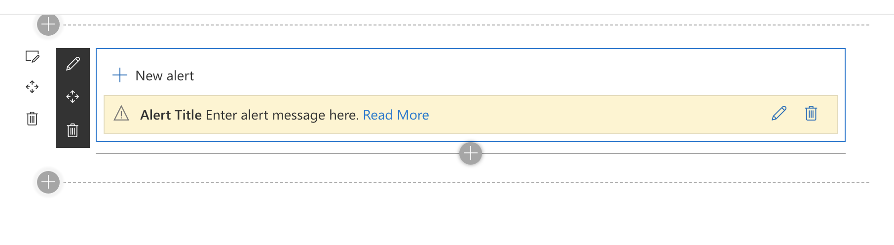

# Scheduled Alert Webpart for SharePoint Framework

This webpart makes it easy to display an alert message on a modern SharePoint page. The alert is similar in style to the Fluent UI MessageBar control.

With this webpart you can schedule multiple alerts to appear with a start and end date. This is useful if you have an intranet home page, for example, and you want to display a new message each day leading up to an important event (e.g. company benefits enrollment). If no alerts are scheduled, the webpart does not display anything and removes any whitespace that it would normally take up; it's like the web part isn't even on the page.

This web part uses React and supports section backgrounds and translations.



## Building the code

```bash
git clone the repo
npm i
npm i -g gulp
gulp
```

See the [SharePoint Framework documentation](https://docs.microsoft.com/en-us/sharepoint/dev/spfx/set-up-your-development-environment) for help getting started.

This package produces the following:

- lib/\* - intermediate-stage commonjs build artifacts
- dist/\* - the bundled script, along with other resources
- deploy/\* - all resources which should be uploaded to a CDN.

## Build options

`gulp clean` - cleans up all build-related files

`gulp test` - runs tests

`gulp serve` - runs local server to try out webpart

`gulp bundle` - bundles assets to maek them ready for packaging into a solution file (use `gulp bundle --ship` for production builds)

`gulp package-solution` - packages the solution to a .sppkg file ready for deployment to an app catalog site (use `gulp package-solution --ship` for production builds)
